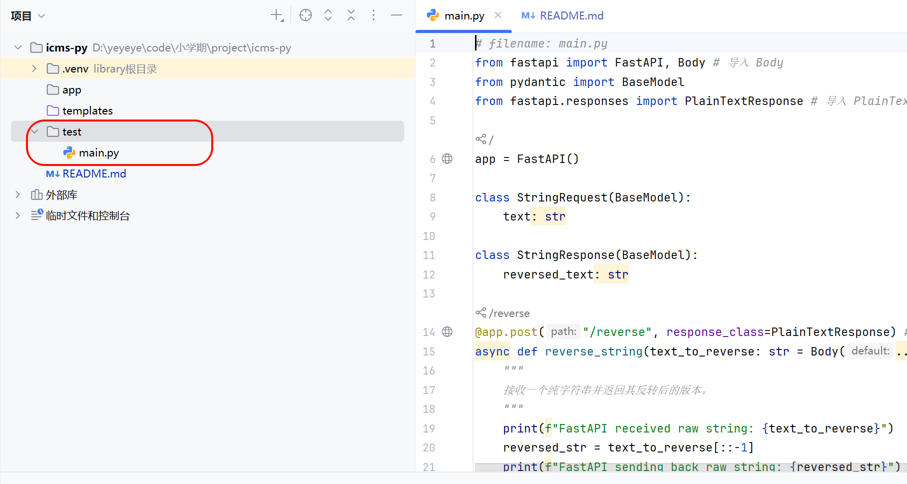

fastapi官网：https://fastapi.tiangolo.com/zh/#_2
1.安装fastapi
pip install fastapi
pip install "uvicorn[standard]"

cd test

运行命令：uvicorn main:app --reload 即可启动python后端

此时启动java后端，点击前端custom按钮，访问localhost:8090/test/reverse或在f12控制台信息

即可看到反转的字符串

使用pip install -r requirements.txt 安装目前所需的所有依赖

uvicorn pullStream:app --reload

deepface包下载在py3.11虚拟环境中下载

pip install deepface==0.0.93 "tensorflow~=2.19.0"

运行报错试一下

pip install tf-keras

登录的人脸识别逻辑 先安装

pip install fastapi uvicorn requests numpy scipy

